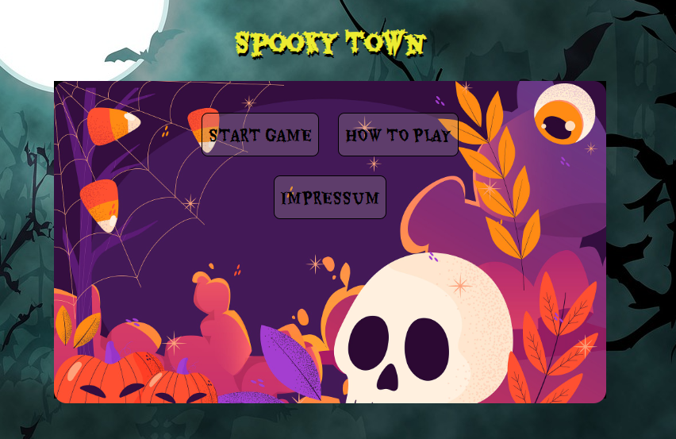
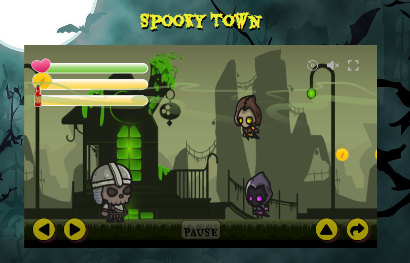
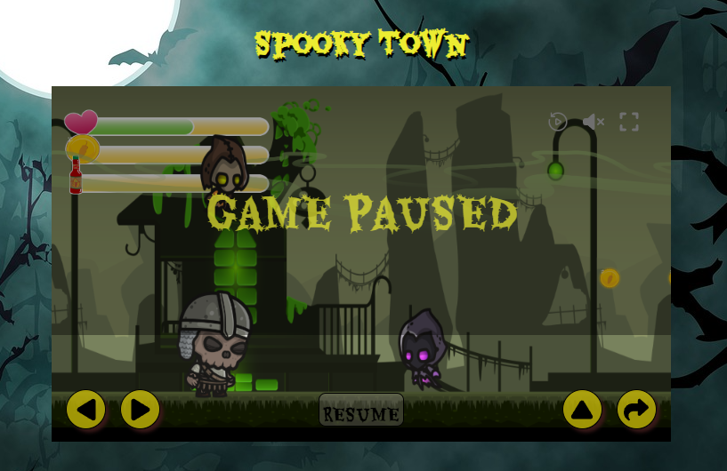

# 🎮 Spooky Town
A 2D Run-and-Jump Adventure

## 🧟 About the Game
Spooky Town is a 2D platformer where you play as the Skeleton Warrior. Your mission: jump, dodge, and bottle-throw your way through a haunted town crawling with Wraiths and an epic Endboss — the Golem.

## 🕹️ Gameplay Features

✅ Run-and-jump platforming action  
🪙 Collect coins and bottles  
🧴 Throw bottles to damage enemies  
👻 Encounter 3 types of small Wraiths  
🪨 Battle a massive Golem Endboss  
🎭 Unique end screens based on game outcome  
📜 Start screen with:  
Controls overview  
Impressum / Developer credits  

🧩 In-game UI options:

Mute/unmute  
Pause/resume  
Restart game  
Fullscreen toggle  

## 📱 Mobile & Tablet Support
🎮 Fully playable on mobile and tablet with on-screen buttons

📲 Responsive UI tailored for smaller screens

## 🎮 Controls

| Action       | Key / Input              |
| ------------ | --------------------     |
| Move Left    | ← / On-Screen Button     |
| Move Right   | → / On-Screen Button     |
| Jump         | Space / On-Screen Button |
| Throw Bottle | D / On-Screen Button     |

## 🏁 Goal
Survive Spooky Town, eliminate enemies, and defeat the Golem to win the game. Each ending shows a different screen depending on who falls first: the Skeleton Warrior or the Golem.

## 🚀 Live Deployment
Play Spooky Town online here:
[Click to play Spooky Town](https://doratelekesi.github.io/Spooky-Town/)

## 🔮 Future Implementation
Planned features for upcoming versions:

🧟 New enemy types (e.g., flying or ranged units)  
🌍 Multi-level gameplay  
⚔️ Additional weapons and attack types  
🏆 Scoreboard and achievements system  

## ℹ️ Impressum / Credits
Check the in-game Impressum for:

👨‍💻 Developer & Designer  
📄 Copyright  
🎵 Assets & Audio attributions  
📘 License info  

## 📄 License
This project is licensed under the MIT License – see the LICENSE file for details.

## Screenshots

  
  
  

